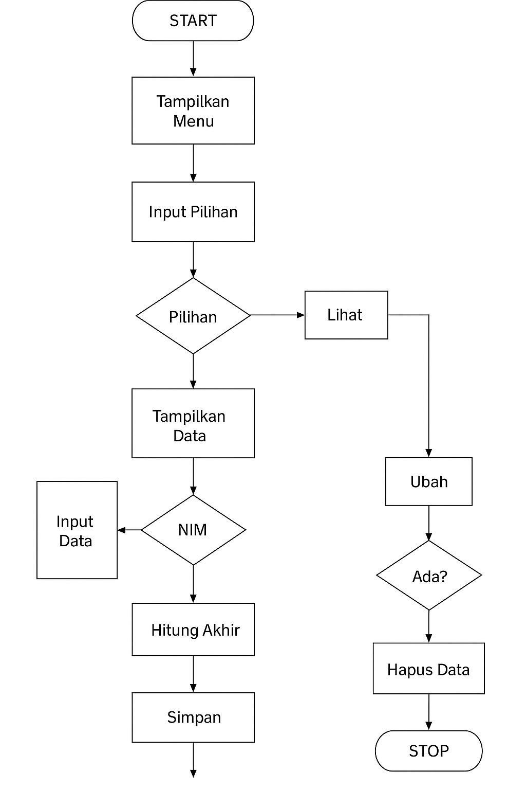

# Latihan 1 <a href="Latihan1.py">LINK</a>
<ul>
<li>Isi awal kontaknya:
</ul>
<pre>
Ari → 081267888

Dina → 087677776
</pre>

### Setelah itu program ngelakuin beberapa operasi:
<ol>
<li>Nampilin kontak Ari

Program ngambil value dari key "Ari" dan ngeprint nomornya.

<li>Nambah kontak baru

Kontak baru dengan nama "Riko" ditambahin ke dictionary:

<pre>contacts["Riko"] = "087654544"</pre>

<li>Ngubah nomor kontak Dina

Nomor Dina diganti dengan nomor baru:

<pre>contacts["Dina"] = "088999776"</pre>

<li>Nampilin semua nama kontak

contacts.keys() dipake buat ngambil semua nama (key) dari dictionary.

<li>Nampilin semua nomor HP

contacts.values() ngambil semua nomor telepon (value).

<li>Nampilin semua kontak lengkap

Program looping pake:

for nama, nomor in contacts.items():

Terus nampilin nama dan nomornya satu per satu.

<li>Hapus kontak Dina

Kontak Dina dihapus dari dictionary pake:

<pre>contacts.pop("Dina")</pre>

<li>Nampilin hasil akhir

Sisa daftar kontak setelah Dina dihapus ditampilin.

</ol>

 

# Praktikum <a href="Praktikum.py">LINK</a>

<pre>
<ol>
<li>Lihat Data
Menu ini buat nampilin semua data mahasiswa yang udah masuk.
Tampilannya dalam bentuk tabel rapi berisi NIM, nama, nilai tugas, UTS, UAS, sama nilai akhir.

<li>Tambah Data
Di sini kita masukin data mahasiswa baru:

<ul>
<li>NIM

<li>Nama

<li>Nilai Tugas

<li>Nilai UTS

<li>Nilai UAS
</ul>

<li>Setelah itu program otomatis ngitung nilai akhir berdasarkan rumus:

30% Tugas + 35% UTS + 35% UAS

<li>Ubah Data
Dipake kalau ada data mahasiswa yang mau di-edit.
Cukup masukin NIM yang mau diubah, terus input data barunya.

<li>Hapus Data
Menu ini buat ngapus data mahasiswa. Cukup ketik NIM-nya, nanti datanya dihapus dari dictionary.

<li>Cari Data
Fungsinya buat nyari mahasiswa berdasarkan NIM.
Kalau datanya ada, bakal ditampilin lengkap.

<li>Keluar Program
Buat nutup program.
</ol>
</pre>

# Flowchart
